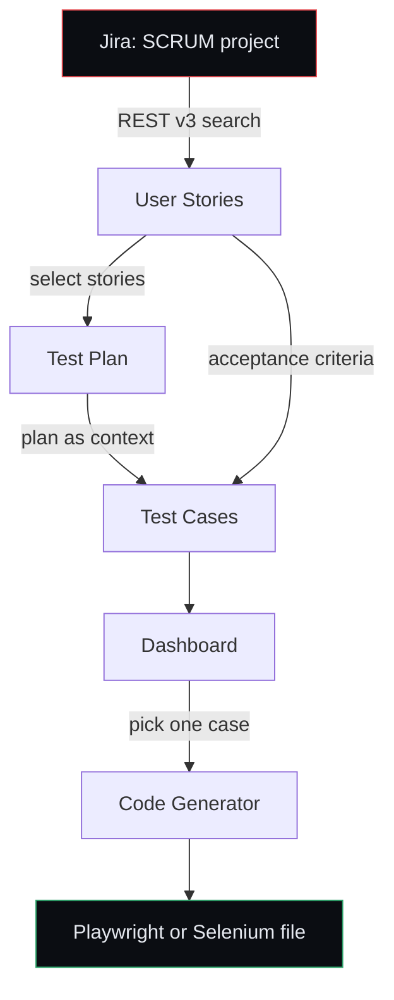

# Project 07 — Test Orchestrator

## The task

Build a web application called **Test Orchestrator** with five features:

1. **Jira Integration** — fetch user stories directly from Jira
2. **Auto Test Plan Generation** — build a test plan from the fetched stories
3. **Smart Test Case Creation** — derive test cases from story requirements
4. **Test Case Dashboard** — every generated case in one organised list
5. **Code Generator** — turn a selected case into Selenium or Playwright automation code

Constraints: React frontend, Node backend, Jira and LLM reached over API keys.

The underlying idea is that these five features are not five separate tools. They
are one pipeline. A requirement enters as a Jira ticket and leaves as code, and
each stage is better because of the stage before it.

## What we built

A two-process application. The browser never holds a credential — Vite proxies
`/api` to the backend, and every Jira or LLM call is made server-side.

```
src/     React 19 + Vite + TypeScript   :5173
server/  Express 5 + TypeScript         :5007
api/     Vercel serverless wrapper around the same Express app
```

Local dev runs two processes; in production `api/index.ts` exports the Express
app as a serverless function and Vercel serves the built frontend as static
files. The application code is identical in both.

### Backend

| File | Responsibility |
| ---- | -------------- |
| [`config.ts`](server/config.ts) | Loads `.env`, merges per-request overrides, refuses to run half-configured |
| [`services/jira.service.ts`](server/services/jira.service.ts) | Jira Cloud REST v3 — auth, search, ADF flattening, JQL normalisation |
| [`services/llm.service.ts`](server/services/llm.service.ts) | One chat interface over Groq, OpenAI, Claude, Gemini, and Ollama |
| [`services/codeRepair.ts`](server/services/codeRepair.ts) | Deterministic fixes for defects the model repeats |
| [`prompts.ts`](server/prompts.ts) | The three system prompts that define output quality |
| [`routes/`](server/routes/) | Six Jira and generation endpoints |

### Frontend

Six views sharing one store ([`store.tsx`](src/store.tsx)) persisted to
local storage, so a half-finished run survives a refresh: **Settings**,
**User Stories**, **Test Plan**, **Test Cases**, **Dashboard**, **Code Generator**.

A [`PasswordGate`](src/components/PasswordGate.tsx) wraps the app. The deployed
API holds a Jira token and an LLM key, so every route behind `/api` requires a
shared password. Locally `APP_PASSWORD` is unset and the gate resolves open.

## How the workflow runs



### 1. Settings

Point the app at a Jira site and choose a model. Credentials live in
`.env`; anything typed here overrides them for that browser only, so the
token never has to leave the server.

### 2. User Stories

Fetch by project key, issue key, or raw JQL — all three work in either box.
Jira returns descriptions as **Atlassian Document Format**, a nested node tree
rather than text, so the service walks it and keeps the prose, bullets, and
tables an LLM needs. If a story has an *Acceptance Criteria* section, it is
extracted separately and stops cleanly at the next heading.

Tick the stories to orchestrate. Selection drives every later stage.

### 3. Test Plan

The selected stories become a Markdown plan: scope, objectives, features table,
approach, environment, entry/exit criteria, risks table, and — deliberately —
**Assumptions & Open Questions**. The prompt forbids inventing requirements, so
when a story is silent the model must say so instead of guessing.

### 4. Test Cases

Stories plus the approved plan produce structured JSON: id, type, priority,
preconditions, steps, expected result, test data. The prompt demands at least one
case per acceptance criterion and concrete actions — *"Click Sign in and observe
the redirect to /dashboard"*, never *"verify the page works"*.

Ids are re-keyed server-side (`SCRUM-5-TC-001`) because models drift on format
and duplicate numbers across stories.

### 5. Dashboard

Every case in one place, filterable by story, type, and free text, with counts
for total, covered stories, automated, and awaiting code. Export to JSON, or
send a case to the generator.

### 6. Code Generator

One case, one framework, one language, one file: a page object plus the spec
that uses it.

- **Playwright** — role/label locators, web-first assertions, no `waitForTimeout`
- **Selenium** — explicit `WebDriverWait`, never `Thread.sleep`

Where the case does not pin down a selector, the model must emit a named
placeholder with a `TODO` rather than invent one and present it as real.

## Three problems worth recording

**Models emit uncompilable code, and prompting does not fix it.** Two defects
recurred: annotating with Playwright's `Page` without importing it, and defining
a page object *while also* importing it from a sibling path — a duplicate
identifier. Adding rules to the prompt did not stop either.
[`codeRepair.ts`](server/services/codeRepair.ts) fixes both deterministically
and is a no-op on correct output. Sixteen unit tests cover it and the JQL
normaliser: `npm test` at the project root.

**Free-tier rate limits shape the design.** Groq allows 12,000 tokens per minute,
and a plan-then-cases run exceeded it. The client now right-sizes `max_tokens`
per task and honours the provider's `Retry-After` instead of surfacing a 429 the
user can do nothing about.

**Input should be forgiving.** Typing `SCRUM-5` into a JQL box is the natural
thing to do, and Jira answers with a parser error. The service now converts bare
issue keys and project keys into valid JQL, and passes real JQL through untouched.

## Verified end to end

Against a live Jira site, no mocks:

```
SCRUM project → 5 stories fetched
  → Test Plan    8 sections
  → Test Cases   SCRUM-4-TC-001, SCRUM-3-TC-001, SCRUM-4-TC-002, SCRUM-3-TC-002
  → Dashboard    filter, export, select
  → Code Gen     56 lines of Selenium Java, WebDriverWait present, Thread.sleep absent
```

Both apps typecheck clean; 16/16 unit tests pass; no console errors.

## Running it

See [README.md](README.md) for setup, environment variables, and the API table.

## What it is not

Generated cases are a **first draft that shortens the blank page**, not a
substitute for a tester's judgement. Selector placeholders are marked `TODO` on
purpose. A 70B model produces sound structure and drifts on detail — for code you
intend to run with light editing, a stronger model earns its cost.
