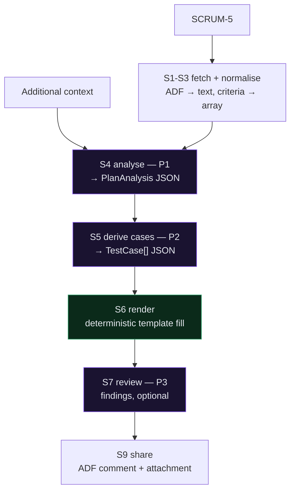

# Project 08 — Test Plan Generator (QA Agent)

## The task

Build an intelligent test-plan creator. A user adds a connection to their tracker
on the fly, enters a work-item ID, and the agent fetches that item and produces a
test plan using the team's own template. Add an LLM connection — Ollama, Groq,
Grok, and others — with a Test Connection button on both. Share the result. Show a
dashboard.

Constraints: TypeScript end to end so it runs on Vercel; localhost first.

## What we built

A two-process application, the same shape as
[Project_07](../Project_07_TestOrchestratorChallenge) but inverted where it counts.

```
src/     React 19 + Vite + TypeScript   :5173
server/  Express 5 + TypeScript         :5008
tools/   deterministic modules — the engines
api/     Vercel wrapper around the same Express app
```

### Project_07 vs Project_08

| | Project_07 | Project_08 |
| --- | --- | --- |
| Entry point | project key / JQL → a list | **one work-item ID** (+ linked items you tick) |
| Plan shape | the model invents the structure | **the template owns the structure** |
| Model's job | write the document | return **data**; code writes the document |
| Sharing | download | **back to the ticket** — ADF comment + attachment |
| Model choice | curated list in code | **live list from the provider**, non-chat models filtered |

### The decision everything else follows from

> **The model produces data. Code produces the document.**

No prompt asks for a test plan. P1 returns a 25-field JSON object mirroring the
template's sections; P2 returns test cases; `tools/plan/render.ts` fills the
`{{PLACEHOLDER}}` slots deterministically.

What that buys:

- Section order and boilerplate are byte-identical on every run.
- A missing field is a *reported gap*; an unresolved placeholder is a hard error.
- Swapping the template touches no prompt. Swapping the model changes prose
  quality, never document validity.
- Rendering bugs are code bugs with unit tests. Thin content is a prompt problem.
  The two never get confused.

## The pipeline



Purple is the model — three calls, no more. Green is the renderer. Everything else
is plain code. The client drives the steps one request at a time, because three
chained model calls exceed Vercel's 60-second ceiling; the side benefit is that a
rate limit at step two does not discard step one.

## Five problems worth recording

**A truncated response looks exactly like a weak model.** With `max_tokens: 2500`
the analysis came back with 3 features, no exclusions, no risks and no open
questions, and the plan rendered with fifteen sections quietly on template
defaults. It read like a small model doing its best. It was a capable model cut off
mid-JSON — the prefix parsed, so nothing complained. At 4000 the same ticket
produced 8 features, 3 exclusions, 4 risks and 5 open questions. The client now
checks every provider's own length signal and refuses a truncated reply.
**Before blaming model quality, confirm the model was allowed to finish.**

**"Ignore this section" is not the same as "do not send it".** The review prompt
tells the reviewer to skip the template's boilerplate, and we sent it anyway — 8,446
tokens against Groq's 8,000-per-request ceiling, so the review returned 413 and
could not run at all. Dropping the four boilerplate sections fixed it. What gets
dropped is now named in the prompt *and* returned to the client, because a reviewer
reporting "vague steps" for steps it never saw is worse than no reviewer.

**Provider requirements belong in the client, not in prose discipline.** Groq
rejects JSON mode unless the messages contain the word "json". P1 happened to say
"JSON object"; P2 and P3 described their shape without the word and returned 400.
Both were fixed — the prompts reworded *and* a guard in the client — so a future
prompt edit cannot reintroduce it.

**The out-of-scope section is a trap.** SCRUM-5 lists its acceptance criteria and
then, immediately after, three out-of-scope items. Without a stop at the next
heading, those three become acceptance criteria and generate test cases for
features that do not exist. `tools/util/criteria.ts` stops at the next section, and
that is the first test in its file.

**Colour was computed, not chosen.** Test-case statuses are *states*, so the status
palette applies rather than a categorical one. The validator reported Passed
against Failed at **ΔE 4.1 under deuteranopia** — a red/green pair a deuteranope
cannot separate. Hue therefore carries none of the meaning: every bar has a text
label, a distinct shape glyph, a value at its tip, and a table-view twin. The chart
also shipped with axis labels reading 0, 1, 3, 4, 5 — rounded from 1.25/2.5/3.75, so
no label sat on its own gridline. Screenshotting it is what caught that.

## Verified end to end

Against live Jira and live Groq, no mocks:

```
SCRUM-5 "Customer can sign in to the storefront with email and password"
  → 1412 chars of ADF flattened, 8 acceptance criteria split correctly
  → analyse   6.6s   8 features · 3 exclusions · 4 risks · 5 open questions
  → cases    24.0s   11 cases, AC-1…AC-8 all covered
  → render   0.013s  45 placeholders, 0 unresolved, 14/14 sections
  → review    4.6s   2 findings, 1 Blocker
  total 31.9s → a 24,585-character plan
```

The Blocker is worth quoting, because it is the kind of gap the mechanical
coverage check cannot see:

> AC-6 requires the lockout to last 15 minutes, but no test case verifies that the
> account can be used again after it expires — TC-007 only checks the message.

```
60 unit tests passing   adf 11 · criteria 10 · ids 10 · markdownToAdf 12 · render 17
typecheck clean         both tsconfigs
build                   396 kB js / 11.5 kB css in 705 ms
browser                 9 views screenshotted, 0 React errors
```

## Not yet exercised

**Posting to a real ticket.** `markdownToAdf` has 12 tests and the share preview
renders correctly, but nothing has been posted to a live issue — that writes to a
ticket other people can see, so it waits for an explicit go-ahead.

**Deployment.** `vercel.json` mirrors Project_07's working configuration; the app
has not been pushed yet.

## What it is not

A generated plan is a **first draft that removes the blank page**, not a substitute
for a tester's judgement. The document says so in its own footer, and the UI says
so where the user can see it. Sections filled from template defaults are listed in
the render report on purpose — those are the ones a reviewer should read first,
because the ticket said nothing about them.

Azure DevOps and X-Ray have written SOPs and no code. Picking either up is
implementation, not redesign.
