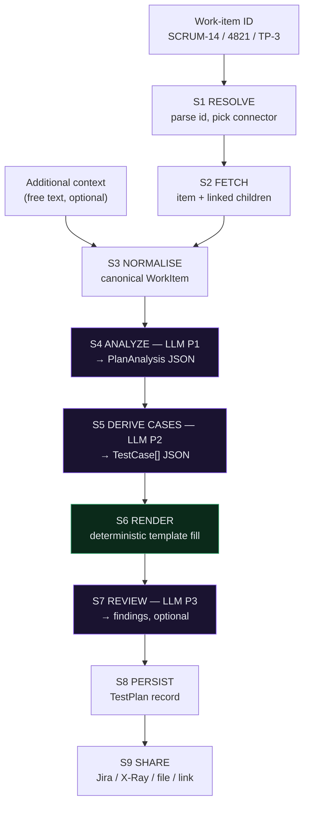

# WORKFLOW — Test Plan Generator (QA Agent)

> **Read this first.** It is the single map of the project: what we build, in what
> order, the exact prompts the agent runs, and how the application behaves at
> runtime. `gemini.md` is the law (schemas + rules). This file is the plan.

> **Scope resolved 2026-07-31 — see `gemini.md` §0.** v1 is **Jira Cloud only**,
> localStorage persistence, `strict` template fidelity, share via Jira comment /
> attachment / file download. Where this document says *"only if Q2 includes ADO"*
> or similar, the answer is now **no** — those SOPs stay written and unbuilt.
> Phases 0–2 are complete; Phase 3 is next.

- **Protocol:** B.L.A.S.T. (Blueprint → Link → Architect → Stylize → Trigger)
- **Architecture:** A.N.T. 3-layer (Architecture SOPs → Navigation → Tools)
- **Stack:** TypeScript end to end. React 19 + Vite frontend, Express 5 API,
  `api/index.ts` serverless wrapper. Local first (`localhost`), then Vercel.
- **Reference implementation:** `../Project_07_TestOrchestratorChallenge` — same
  two-process shape, same Vercel deployment model, proven against live Jira.

---

## 1. What the product is

**One sentence:** paste a work-item ID (Jira, ADO, X-Ray), and the agent returns a
complete, template-conformant, reviewable test plan grounded strictly in that
work item — then shares it back to the tool it came from.

The distinction from Project_07 matters. Project_07 fetched a *list* of stories
and let a model write a plan freehand. Project_08 is **ID-first and
template-first**:

| | Project_07 | Project_08 (this) |
| --- | --- | --- |
| Entry point | Project key / JQL → list | One work-item ID (+ linked children) |
| Connections | Jira only, from `.env` | Jira, ADO, X-Ray — **added on the fly** in the UI, each with **Test Connection** |
| LLM | fixed provider | Groq, **Grok (xAI)**, OpenAI, Claude, Gemini, **Ollama** — live model dropdown + **Test Connection** |
| Plan shape | model invents the structure | **the template owns the structure**; the model only supplies data |
| Output | markdown in the browser | markdown + JSON, **shared back to Jira/ADO/X-Ray**, exported, tracked on a dashboard |

### The reliability rule that drives the whole design

> **The LLM produces data. Code produces the document.**

The model is never asked to "write a test plan". It is asked to return a strict
JSON object (`PlanAnalysis`, `TestCase[]`). A deterministic renderer then fills
the template's `{{PLACEHOLDERS}}`. Consequences:

- Section order, headings, and tables are identical on every run — no drift.
- A missing field is a *reported gap*, never a silent `{{PLACEHOLDER}}` left in
  the document.
- Swapping the template does not require touching a prompt.
- Swapping the model changes prose quality, never document validity.

---

## 2. Build workflow — B.L.A.S.T. phases and tasks

Each task has an ID, an owner layer, and a done-condition. Progress is logged in
`progress.md`; discoveries in `findings.md`.

### Phase 0 — Initialization ✅ *complete*

| ID | Task | Done when |
| --- | --- | --- |
| 0.1 | Create memory files (`task_plan.md`, `findings.md`, `progress.md`) | files exist |
| 0.2 | Create `gemini.md` constitution with the full data schema | schema section filled |
| 0.3 | Study the reference project, record reusable assets | `findings.md` §1 |
| 0.4 | Write this workflow | this file |
| 0.5 | `.env` / `.env.example` seeded from Project_07 credentials | Jira + Groq keys present, `.env` gitignored |
| 0.6 | Default template committed with the placeholder contract | `templates/test_plan.md` |

**HALT.** Per Protocol 0 no code lands in `tools/` until the Discovery Questions
in §6 are answered and the Blueprint is approved.

### Phase 1 — B: Blueprint

| ID | Task | Done when |
| --- | --- | --- |
| 1.1 | Answer the 5 Discovery Questions (§6) | recorded in `gemini.md` |
| 1.2 | Freeze the JSON schemas (input `WorkItem`, output `TestPlan`) | `gemini.md` §Schemas marked FROZEN |
| 1.3 | Decide persistence (localStorage vs Vercel KV) — gates share-links | Q4 answered |
| 1.4 | Confirm dashboard metric semantics | Q1 answered |

### Phase 2 — L: Link (connectivity before logic)

Nothing clever until every wire is proven. Each handshake is a tiny script under
`tools/` runnable with `npm run link:<name>`, printing a real identity, not `ok`.

| ID | Task | Handshake proves |
| --- | --- | --- |
| 2.1 | `tools/link/jira.ts` | `GET /rest/api/3/myself` → display name + account id |
| 2.2 | `tools/link/jira-issue.ts` | one real issue fetched by key, ADF flattened to readable text |
| 2.3 | `tools/link/llm.ts` | 1-token completion from Groq **and** Ollama; prints latency |
| 2.4 | `tools/link/models.ts` | live model list per provider (drives the Settings dropdown) |
| 2.5 | `tools/link/ado.ts` | ADO work item via PAT — *only if Q2 includes ADO* |
| 2.6 | `tools/link/xray.ts` | X-Ray auth token + one test plan read — *only if Q2 includes X-Ray* |

**Gate:** a red handshake blocks Phase 3 for that connector. We do not build on a
broken link.

### Phase 3 — A: Architect (the 3-layer build)

**Layer 1 — `architecture/` (SOPs, markdown).** Written *before* the code, updated
*before* any change. Already scaffolded:

```
architecture/01_connections.md      auth shapes, test-connection contract, error taxonomy
architecture/02_workitem_fetch.md   ID parsing, provider routing, normalisation, ADF/HTML
architecture/03_plan_generation.md  the 9-step pipeline, prompts, token budgets
architecture/04_share_export.md     Jira comment/attachment, X-Ray, file exports
architecture/05_ui_spec.md          nav, views, states, the dashboard chart
```

**Layer 2 — Navigation (`server/agent/`).** The orchestrator. It owns *order*, not
*work*: routes a request through the pipeline, decides when to skip a step, and
never formats a document or calls an HTTP API itself.

**Layer 3 — `tools/` (deterministic TypeScript).** Atomic, unit-testable, no LLM
except in `tools/llm/`.

```
tools/connectors/   jira.ts  ado.ts  xray.ts        one interface, three providers
tools/llm/          client.ts  models.ts  json.ts   chat, live model list, tolerant JSON parse
tools/plan/         analyze.ts  cases.ts  render.ts  review.ts
tools/share/        jira.ts  xray.ts  files.ts
tools/util/         adf.ts  html.ts  ids.ts  metrics.ts
```

| ID | Task | Done when |
| --- | --- | --- |
| 3.1 | `WorkItemConnector` interface + Jira implementation | fetch by ID returns canonical `WorkItem` |
| 3.2 | `tools/util/adf.ts` + `html.ts` with unit tests | nested lists/tables survive flattening |
| 3.3 | `tools/llm/client.ts` — 6 providers, rate-limit retry, JSON mode | Groq + Ollama both answer |
| 3.4 | `tools/llm/models.ts` — live model list per provider | dropdown populates from the provider |
| 3.5 | `tools/plan/analyze.ts` — prompt **P1**, schema-validated | valid `PlanAnalysis` from a real issue |
| 3.6 | `tools/plan/cases.ts` — prompt **P2**, ids re-keyed server-side | ≥1 case per acceptance criterion |
| 3.7 | `tools/plan/render.ts` — deterministic template fill | zero unresolved placeholders; unit tested |
| 3.8 | `tools/plan/review.ts` — prompt **P3**, the QA critic | returns findings, never a rewrite |
| 3.9 | `tools/util/metrics.ts` — dashboard aggregation | counts match the plan store |
| 3.10 | API routes (§4) + password gate | every endpoint answers locally |
| 3.11 | Frontend views (§5) wired to the store | full run works in the browser |

### Phase 4 — S: Stylize

| ID | Task | Done when |
| --- | --- | --- |
| 4.1 | Dark UI matching the sketch: sidebar + panels + stat tiles | screenshot parity |
| 4.2 | Dashboard bar chart (inline SVG, no chart dependency) | renders light + dark, accessible labels |
| 4.3 | Plan viewer: rendered markdown, section jump, inline edit, diff after review | reviewable without leaving the app |
| 4.4 | Share payload formatting — Jira ADF comment, not raw markdown | comment renders as headings/tables in Jira |
| 4.5 | Show the plan to the user for feedback before Phase 5 | approval recorded in `progress.md` |

### Phase 5 — T: Trigger

| ID | Task | Done when |
| --- | --- | --- |
| 5.1 | `npm run typecheck` + unit tests green | 0 errors |
| 5.2 | End-to-end run against live Jira, no mocks | evidence block in `PROJECT.md` |
| 5.3 | Deploy to Vercel behind `APP_PASSWORD` | live URL responds |
| 5.4 | Optional trigger: Jira webhook → auto-draft plan on story transition | *out of scope unless Q5 says otherwise* |
| 5.5 | Maintenance log in `gemini.md` | filled |

---

## 3. Runtime workflow — how the agent actually runs

### 3.1 The pipeline



Purple = LLM (probabilistic, 3 calls). Green = the deterministic renderer.
Everything else is plain code.

### 3.2 Step contracts

| Step | Layer | In | Out | Notes |
| --- | --- | --- | --- | --- |
| S1 RESOLVE | tool | raw string | `{connectionId, provider, ids[]}` | `ABC-123` → Jira · all-digits → ADO · X-Ray keys by prefix. Ambiguity asks, never guesses. |
| S2 FETCH | tool | ids | provider payloads | Optional depth-1 expansion: subtasks, "is blocked by", child issues. |
| S3 NORMALISE | tool | payloads | `WorkItem[]` | ADF → text (Jira), HTML → text (ADO). Acceptance criteria extracted into an array. |
| S4 ANALYZE | LLM **P1** | `WorkItem[]` + context | `PlanAnalysis` | `temperature 0.15`, JSON mode, ~2500 max tokens. |
| S5 CASES | LLM **P2** | `WorkItem[]` + `PlanAnalysis` | `TestCase[]` | `temperature 0.2`, JSON mode, ~4000 max tokens. IDs re-keyed in code. |
| S6 RENDER | tool | template + S4 + S5 | markdown | **No LLM.** Unresolved placeholder → structured error listing each one. |
| S7 REVIEW | LLM **P3** | markdown + `WorkItem[]` | `ReviewFinding[]` | Off by default; user toggles "Review this plan". |
| S8 PERSIST | tool | `TestPlan` | id | localStorage now; server store if Q4 chooses it. |
| S9 SHARE | tool | plan + target | `ShareRecord` | Confirmation dialog before anything leaves the app. |

### 3.3 The prompts

Every prompt below lives in `server/prompts/` as a named export. They are
versioned: changing one is a `gemini.md` amendment, not a casual edit.

#### P0 — GROUNDING (shared preamble, injected into P1/P2/P3)

```text
Ground every statement in the supplied work items and the user's additional
context. You must not invent requirements, field names, URLs, roles, or
acceptance criteria that are not present in the input.

Where the input is silent on something a tester needs, you must record it under
openQuestions instead of filling the gap with a plausible guess. A guess that
reads well is worse than an honest gap, because a reviewer cannot tell it from a
real requirement.

Never soften or restate a requirement you were given. Quote the work-item key
next to any claim that comes from it.
```

#### P1 — ANALYZE_REQUIREMENTS → `PlanAnalysis`

The requested shape is **derived from the template's 15 sections** — the model
fills the document's slots, it does not choose them.

*System:*

```text
You are a senior QA lead. You read a work item and extract the facts a test plan
is built from. You do not write the plan — you produce its structured content,
which a deterministic renderer will place into a fixed company template.

{{P0_GROUNDING}}

Rules:
- features come only from what the work item says is being built. A linked child
  item that the user included is in scope; one they excluded is not.
- Every entry in features cites the work-item key it came from.
- riskLevel is H/M/L and must be justified by something in the item. Payments,
  authentication, data migration, and third-party integrations are High unless
  the item shows otherwise; copy and styling changes are Low.
- exclusions: each entry is marked "stated" when the item says it is out of
  scope, or "inferred" when it is an adjacent area a reader might wrongly assume
  is covered. Never mark an inference as stated.
- testObjectives are falsifiable: "prove a locked account cannot reset its
  password by email", never "ensure quality".
- environments: list only what the item, its labels, or the additional context
  actually imply. Return an empty array for a field the input is silent on — the
  renderer has a documented default and will use it. An empty array is the
  correct answer; a guessed browser matrix is not.
- schedule durations are estimates in days derived from the number and risk of
  features. Say so in `timeline`.
- entryExitCriteria covers the STLC phases the item touches: Requirement
  Analysis, Test Design, Test Execution, Test Closure.
- tools: name only tools evidenced by the input or the connection in use.

Return ONLY a JSON object of exactly this shape. No prose, no code fence:

{
  "productName": "...",
  "targetAudience": "...",
  "objectiveDetail": "2-3 sentences a manager can read",
  "testObjectives": ["..."],
  "introduction": "purpose, scope and goals of this plan, 3-4 sentences",
  "features": [{"workItemKey":"...","feature":"...","riskLevel":"H|M|L","priority":"High|Medium|Low","rationale":"..."}],
  "testingTypes": ["Manual|Automated|Performance|Accessibility|Security|Regression|Smoke|Usability"],
  "evaluationCriteria": ["..."],
  "teamRoles": [{"role":"...","responsibility":"..."}],
  "exclusions": [{"item":"...","basis":"stated|inferred"}],
  "environments": {
    "operatingSystems": [], "browsers": [], "devices": [], "network": [],
    "hardwareRequirements": [], "securityProtocols": [], "accessPermissions": [],
    "baseUrl": ""
  },
  "defectCriteria": ["..."],
  "defectTrackingTool": "...",
  "communicationChannels": ["..."],
  "defectMetrics": ["..."],
  "testTechniques": ["Equivalence Class Partitioning|Boundary Value Analysis|Decision Table|State Transition|Use Case Testing"],
  "smokeScope": "which critical paths must pass before detailed testing starts",
  "e2eFlows": ["the real user journeys this change sits inside"],
  "schedule": [{"task":"...","duration":"...","owner":"..."}],
  "timeline": "...",
  "deliverables": ["..."],
  "entryExitCriteria": [{"phase":"...","entry":["..."],"exit":["..."]}],
  "tools": [{"name":"...","purpose":"..."}],
  "risks": [{"risk":"...","impact":"High|Medium|Low","likelihood":"High|Medium|Low","mitigation":"..."}],
  "assumptions": ["..."],
  "openQuestions": ["..."]
}
```

*User:* the rendered work items (`renderWorkItem()` per item, `---` separated),
then the additional-context block verbatim if present, then the list of template
sections being filled — so the analysis covers exactly what this document needs
and nothing it does not.

#### P2 — DERIVE_TEST_CASES → `TestCase[]`

*System:*

```text
You are a senior QA engineer producing executable test cases from a work item and
its approved analysis.

{{P0_GROUNDING}}

Coverage rules:
- At least one case per acceptance criterion. If an AC implies both a success and
  a failure path, that is two cases.
- Include positive, negative/validation, and boundary cases. Add security,
  accessibility, or permission cases only where the item genuinely implies one.
- Steps are concrete actions in the imperative, each on its own numbered line.
  "Verify the page works" is rejected. "Enter 0 in Quantity and click Update,
  then observe the inline error" is accepted.
- expectedResult states one observable outcome. Not a list of hopes.
- preconditions name the state and the account role required.
- Where the item does not pin down a selector, label, or URL, say what you need
  in `gaps` for that case rather than inventing it.

Return ONLY:

{
  "testCases": [
    {
      "workItemKey": "...",
      "acceptanceCriterionRef": "AC-1 | null",
      "title": "imperative summary of what is proven",
      "type": "Positive|Negative|Boundary|Security|Accessibility|Performance|Usability",
      "priority": "High|Medium|Low",
      "preconditions": ["..."],
      "steps": ["1. ...", "2. ..."],
      "expectedResult": "...",
      "testData": "concrete values, or empty string",
      "automatable": true,
      "gaps": ["..."]
    }
  ]
}
```

IDs are **not** requested from the model — `tools/util/ids.ts` assigns
`<KEY>-TC-001` sequentially. (Project_07's finding: models duplicate and drift on
ID format across stories.)

#### P3 — REVIEW_PLAN → `ReviewFinding[]` *(the self-annealing critic)*

*System:*

```text
You are an adversarial QA reviewer. You are shown a generated test plan and the
work items it claims to be based on. Your job is to find where the plan is wrong,
unsupported, or incomplete — not to praise it and not to rewrite it.

Report only findings you can tie to specific evidence. For each one give the
section, the severity, what is wrong, and the smallest change that fixes it.

Look for, in this order:
1. Unsupported claims — a requirement, URL, field, or role in the plan that does
   not appear in any work item.
2. Coverage gaps — an acceptance criterion with no test case.
3. Vague steps — a step a new tester could not execute without asking.
4. Wrong risk calls — High risk labelled Low, or the reverse.
5. Contradictions between sections.

An empty findings array is a valid and expected answer for a good plan. Do not
manufacture findings to look thorough.

Return ONLY:
{"findings":[{"section":"...","severity":"Blocker|Major|Minor","issue":"...","evidence":"...","fix":"..."}]}
```

Findings surface as a review panel next to the plan. The user applies them; the
agent does not silently rewrite an approved document.

### 3.4 Token and time budgets

Vercel's function ceiling is 60s (`maxDuration: 60`). Three chained LLM calls in
one request will exceed it on a slow model. **Therefore the client drives the
pipeline step by step** — `/analyze`, then `/cases`, then `/render` — each well
inside the limit, each showing progress in the UI. A single `/generate`
convenience endpoint exists for local use and CLI only.

| Call | max_tokens | temperature | JSON mode |
| --- | --- | --- | --- |
| P1 analyze | 2500 | 0.15 | yes |
| P2 cases | 4000 | 0.20 | yes |
| P3 review | 1500 | 0.10 | yes |

Groq's free tier allows ~12k tokens/minute; the client honours `Retry-After` and
fails fast on per-day quotas rather than sleeping for hours (Project_07 finding,
`findings.md` §2).

---

## 4. API surface

All routes sit behind `/api`. `APP_PASSWORD`, when set, gates everything except
`/api/health` — the deployed API holds a Jira token and an LLM key, so every
route is a capability worth protecting.

| Method | Route | Purpose |
| --- | --- | --- |
| GET | `/api/health` | liveness + whether the password gate is on |
| POST | `/api/auth` | check a password with no side effects |
| GET | `/api/config` | what the server has configured (**never key material**) |
| POST | `/api/connections/test` | **Test Connection** — returns the real identity behind the credential |
| GET | `/api/llm/models?provider=` | live model list for the Settings dropdown |
| POST | `/api/llm/test` | **Test Connection** for the model — 1-token round trip + latency |
| POST | `/api/workitems/fetch` | `{connection, id, includeLinked}` → `WorkItem[]` |
| GET | `/api/templates` | available templates + their placeholder contract |
| POST | `/api/plan/analyze` | S4 → `PlanAnalysis` |
| POST | `/api/plan/cases` | S5 → `TestCase[]` |
| POST | `/api/plan/render` | S6 → markdown (deterministic, no LLM) |
| POST | `/api/plan/review` | S7 → `ReviewFinding[]` |
| POST | `/api/share/jira` | comment or attachment on the source issue |
| POST | `/api/share/xray` | create/update an X-Ray test plan *(if Q2 includes it)* |
| POST | `/api/share/export` | markdown / JSON / CSV download payload |

Credentials never reach the browser. Anything typed into Connections or Settings
is sent per request and overrides `.env` for that request only — the pattern
proven in Project_07's `resolveJiraConfig`.

---

## 5. The application, screen by screen

Sidebar, matching the sketch and extended where the flow needs it:

```
┌────────────────┬─────────────────────────────────────────────┐
│  Dashboard     │                                             │
│  Generate      │   Test Plan Dashboard                       │
│  Plans         │  ─────────────────────────────────────────  │
│  Templates     │  ┌────────┐┌────────┐┌────────┐┌────────┐   │
│  Connections   │  │ Total  ││ Passed ││ Failed ││In Prog.│   │
│  Settings      │  └────────┘└────────┘└────────┘└────────┘   │
│                │  ┌───────────────────────────────────────┐  │
│                │  │  Test Results Overview — bar graph    │  │
│                │  └───────────────────────────────────────┘  │
└────────────────┴─────────────────────────────────────────────┘
```

*Deviation from the sketch, flagged for approval:* the sketch shows three items
(Dashboard, Settings, Connections). A plan generator needs somewhere to actually
run and somewhere to keep results, so **Generate**, **Plans**, and **Templates**
are added. Say the word and they collapse into Dashboard instead.

### Dashboard
Four stat tiles + a bar chart of test-case outcomes, plus recent plans with their
work-item key, model used, case count, and share status. *Metric semantics are
open question Q1.*

### Generate — the main flow
1. Pick a connection (or use the default) and type the ID: `SCRUM-14`.
2. **Fetch** → the work item renders as a card: summary, type, status, priority,
   labels, description, extracted acceptance criteria, link back to the tool.
   Linked children appear as checkboxes to include.
3. **Additional context** — a free-text box for what the ticket does not say
   (environment quirks, a Figma note, a regression to protect). Injected verbatim
   into P1/P2, never summarised away.
4. Pick a **template**, set author/version/environment/browser.
5. **Generate** → live step indicator: Analyze → Cases → Render (→ Review).
6. Plan appears rendered, with the analysis JSON and the case table beside it.

### Plans
Every generated plan, filterable by work item, model, date, and share status.
Open, edit, re-render after a template change, export, share.

### Templates
`templates/test_plan.md` is the default — the team's own 15-section plan, ported
from `Chapter_02_Prompt_Eng/Project_02_RealProject1/Prompt_Templates/test_plan.md`
with its `<angle-bracket>` slots turned into a declared `{{PLACEHOLDER}}` contract.
Editable in the browser; the editor validates that every placeholder used is one
the renderer can supply, so an unknown placeholder is a save-time error rather
than a runtime surprise. A **fidelity** switch per template chooses `strict`
(boilerplate untouched, default) or `enriched` (story-specific bullets appended,
each marked). Additional templates can be added; the contract is shared.

### Connections
A card per connection. **+ Add connection** → choose Jira / ADO / X-Ray, fill the
auth fields, press **Test Connection**. The result is the identity behind the
credential ("Connected to singhkd332.atlassian.net as Kd Singh"), because `ok` is
not proof. Verified connections show a green check with the timestamp.

### Settings
Per the sketch: **Test Model** dropdown (live from the provider), **API Key**,
**Test Connection**, **SAVE**. Providers: Groq, Grok (xAI), OpenAI, Claude,
Gemini, Ollama (local). Blank fields fall back to the server's `.env`, so the
common case is "choose a model and go".

---

## 6. Discovery Questions — need answers before Phase 3

**Q1 — Dashboard metrics.** "Total / Passed / Failed / In Progress": do these
count (a) the statuses of test cases generated in this app and tracked by hand,
(b) real execution results pulled from X-Ray or Jira, or (c) plan-level counts
(plans drafted / approved / shared)? This decides whether the dashboard needs an
execution-results connector.

**Q2 — Connectors in v1.** Jira alone first, or Jira + ADO, or all three
including X-Ray? All three sit behind one interface either way; the question is
what we test end-to-end now versus stub.

**Q3 — Sharing.** Which of these is "share": a comment on the source issue, a
markdown attachment on the issue, a real X-Ray test plan entity, a file download
(MD/JSON/CSV), a public link, or several?

**Q4 — Persistence.** Browser localStorage (zero infrastructure, private to one
browser, no share links) or a server store such as Vercel KV/Postgres (history
survives, team-visible, share links possible)?

**Q5 — Behavioural rules.** Anything the agent must never do? Candidates already
assumed: never invent a requirement, never post to Jira without confirmation,
never leave an unresolved placeholder, never claim a connection works without
naming the account behind it.

**Q6 — Template fidelity.** `templates/test_plan.md` carries deliberate boilerplate
(the OS/browser lists, the defect-triage steps, the best-practice paragraphs).
Should the agent leave that boilerplate exactly as written and fill only the
declared slots (**strict**), or also tailor those sections to the story with
marked additions (**enriched**)? Strict is the safer default; enriched produces a
more specific document that a reviewer must read more carefully.

Answers land in `gemini.md`, and Phase 1 closes.
